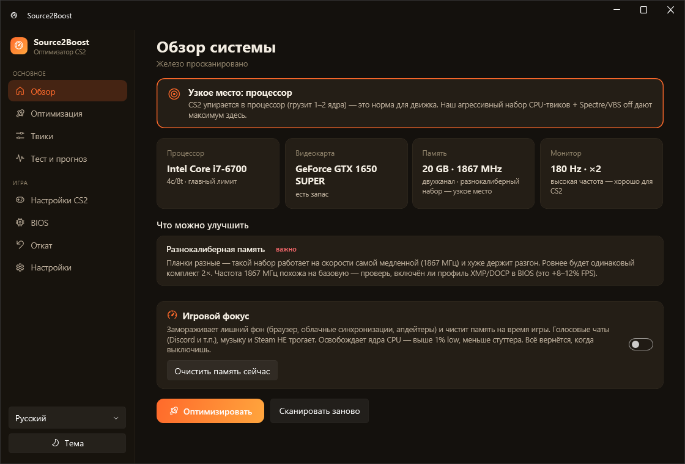

# Source2Boost

Оптимизатор Counter-Strike 2 для выжимания максимума FPS и ровного фреймтайма на любом, в том числе **старом**, железе. Понятен новичку, красивый минималистичный интерфейс (Fluent), русский / українська / English.

> Делает то же, что консольные `cs2-omz` и `CS2 Ultimate Optimization`, но с нормальным UI, мультиязычностью, живым мониторингом фреймтайма и безопасным откатом.



## Что умеет

- 🔎 **Сканирует железо** и ставит диагноз (CPU-bound? память? частота монитора?).
- ⚡ **Два режима**: «Оптимизировать» в один клик и продвинутый чек-лист с галочками по каждому твику (риск + эффект).
- 🖥 **Системные твики**: timer resolution, MMCSS, питание/core parking, службы, реестр.
- 🎮 **Настройки CS2**: генерация `autoexec.cfg` и launch options под твоё железо и герцовку.
- 🌐 **Сеть**: Nagle off, UDP-буферы, QoS, DNS.
- 📈 **Мониторинг**: живой график FPS/фреймтайма (PresentMon), режим «до/после».
- ↩️ **Безопасность**: бэкап реестра + точка восстановления Windows перед каждым применением, откат в один клик.

## Стек

C# / .NET 8 · WPF + WPF-UI (Fluent) · PresentMon · установщик Inno Setup (`setup.exe`).

## Структура

```
src/Source2Boost.App    WPF-интерфейс (Fluent), ViewModels, локализация
src/Source2Boost.Core   движок твиков, детект железа, CS2-конфиги, бэкап/откат
tools/                  PresentMon (мониторинг фреймтайма)
installer/              скрипт Inno Setup
docs/                   TWEAKS.md — каталог твиков + прочая документация
```

## Требования

Windows 10/11 x64. Программа запрашивает права администратора (нужны для системных твиков). VAC-safe: не вмешивается в процесс игры.

## Сборка

```powershell
dotnet build Source2Boost.sln -c Release
# сборка установщика:
dotnet publish src/Source2Boost.App/Source2Boost.App.csproj -c Release -r win-x64 --self-contained true -o publish
& "C:\Program Files (x86)\Inno Setup 6\ISCC.exe" installer\Source2Boost.iss
```

## Статус

🚧 В активной разработке. См. [docs/TWEAKS.md](docs/TWEAKS.md).

## Лицензия

[MIT](LICENSE) — используй, форкай и меняй свободно.
